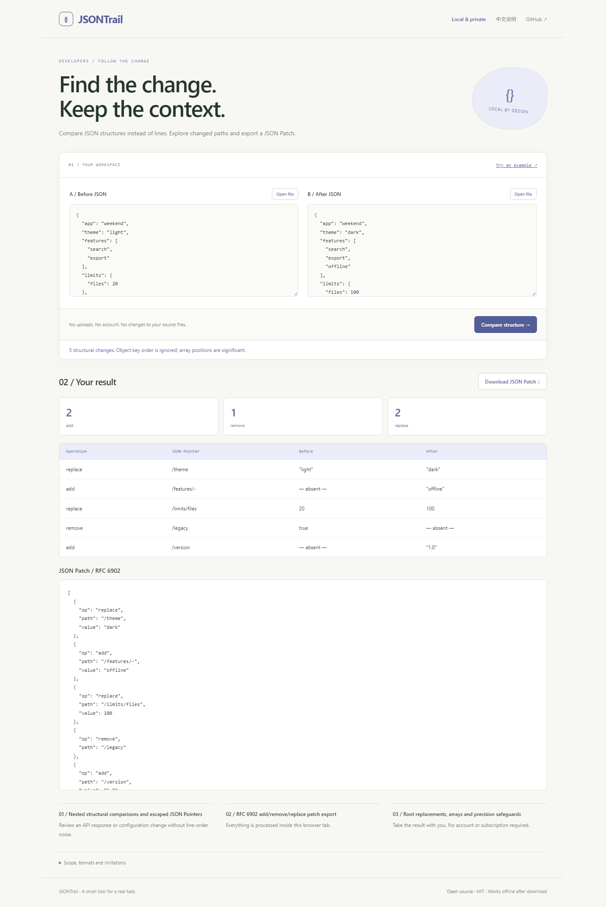

# JSONTrail

**Find the change. Keep the context.**

Compare JSON structures instead of lines. Explore changed paths and export a JSON Patch.

[Open the app](https://sq2100.com/jsontrail/) · [Download offline HTML](https://github.com/sq2100/jsontrail/releases/latest) · [简体中文](README.zh-CN.md)



## Why use it?

Review an API response or configuration change without line-order noise.

- Nested structural comparisons and escaped JSON Pointers
- RFC 6902 add/remove/replace patch export
- Root replacements, arrays and precision safeguards

No uploads, account, API key, tracking scripts, or runtime CDN dependencies. The built app is a single HTML file. Source files are never modified.

## Quick start

Open the [hosted app](https://sq2100.com/jsontrail/) and click **Try an example**. Or download the HTML from [Releases](https://github.com/sq2100/jsontrail/releases/latest), then open it in a modern desktop browser.

To build from source (Node.js 20.19+):

```sh
npm ci
npm test
npm run build
```

Open `dist/index.html`, or run `npm start` for a local preview at http://127.0.0.1:4178. Set the `PORT` environment variable to run multiple projects simultaneously.

## Scope and limitations

Uses native JSON semantics: duplicate object keys use the last value, decimals use IEEE-754 numbers, and object key order is ignored. Unsafe integers and non-finite parsed numbers are rejected; encode large IDs as strings. Arrays are compared by index, not semantic identity. Generates add, remove and replace operations; no move optimization or patch application. File imports up to 5 MiB and nesting up to 150 levels. Preview tables show the first 500 changes; the patch includes all changes.

The initial version targets modern desktop browsers. Chromium is used for local smoke checks. Browser differences and real-world data may reveal additional edge cases; please report reproducible problems with synthetic examples. No guarantee of suitability for every input is made.

## Privacy

The app processes data in memory and has no application server, analytics, cookies, local storage or external runtime resources. A Content Security Policy blocks network connections and external scripts. User data is rendered as text, except for the intentionally previewed local images and validated colors.

The hosting provider receives normal page-request metadata (such as IP addresses). Download the HTML and open it offline for disconnected work. Exported files may contain your data. Browser extensions, the operating system and a modified hosted copy are outside this app's control.

## Development

Plain JavaScript, browser APIs, Node’s built-in test runner, and esbuild. Core logic lives in `src/core.js`; UI behavior is in `src/app.js`. Run `npm run format` before sending changes. GitHub Actions tests and builds each push; the separate Pages workflow publishes the demo when run manually.

[Contributing](CONTRIBUTING.md) · [Security](SECURITY.md) · [MIT license](LICENSE)
